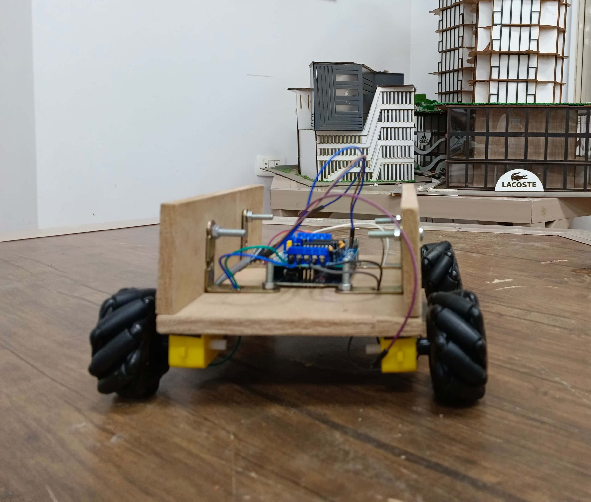
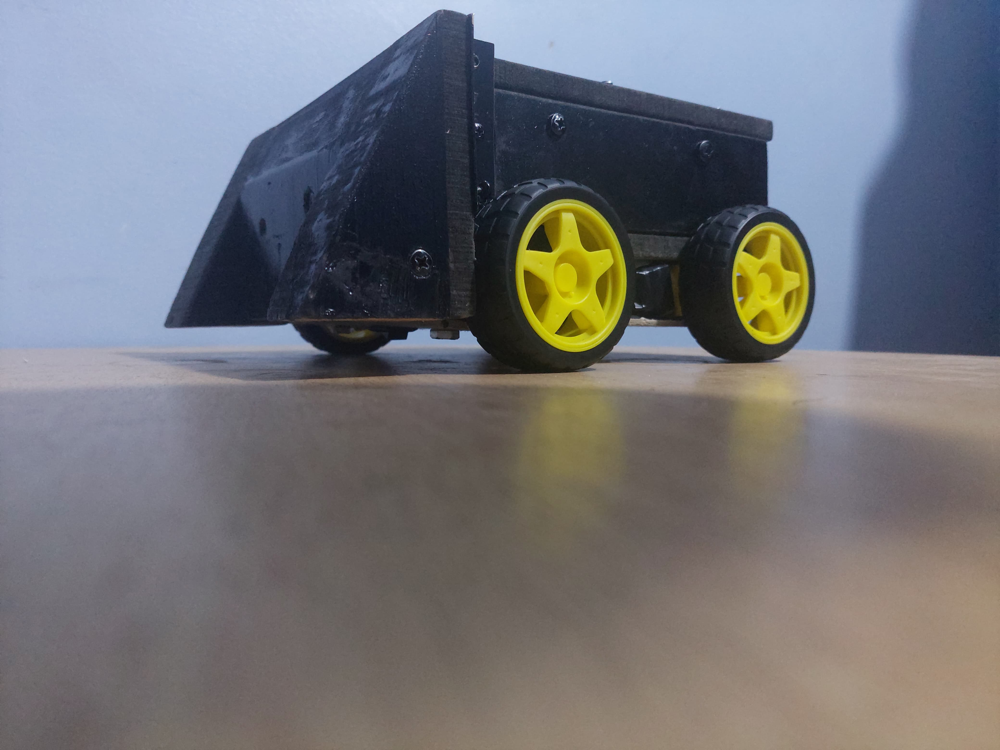

# Omni-Directional Wheel Controlled Car Team Project

## Overview

This project was developed by the Magnum Team as part of a Robo Soccer competition.

---

## Goals

1. **Goal:** Create a robot capable of competing in the Robo Soccer tournament from scratch. From mechanical design to electronics to the software control system.
2. **Lessons learned:** Working in a coll.

---
## Components

The robot was constructed using the following components:

### Mechanical Components:
- **Materials:** MDF wood (9 mm thickness), ordinary wood, cardboard.
- **Wheels:** Four McNamum wheels for omni-directional movement, four regular wheels.
- **Structural Components:** Hinges, screws, battery holders.

### Electronic Components:
- **Microcontroller:** Arduino UNO.
- **Motor Driver:** L293D H-Bridge motor shield (4 channels).
- **Motors:** Four DC geared motors.
- **Power Supply:** Three 4-volt batteries and a 3-cell 18650 battery holder.
- **Other Electronics:** HC-05 Bluetooth module, two-pin switch button.

---

## Development Process

### 1. **Component Selection**
- We have chosen the components based on cost, effectiveness, and which were available to purchase

### 2. **Mechanical Design**
- Design evolved through multiple iterations:
  - Early attempts with Blender and hand-drawn sketches.
  The final design was divided into layers: a lower level for batteries and motors, and an upper level for controllers and electronics.
  - Components were fabricated and adjusted using drills and wood workshop components.

### 3. **Hardware/Software Integration**
- Early coding tested motor and movement functionality.
The final control code used a joystick controlled from a phone app using Bluetooth for omnidirectional movement, enabling smooth gameplay control.
- Several challenges, including hardware failures and design mismatches, were overcome through teamwork.

### 4. **Competition Day**
- Regular wheels were kept as a backup due to concerns about McNamum wheels poor performance on smooth surfaces.
- Overcome challenges with wheel compatibility with last-minute adjustments.
---

## Lessons Learned

1. **Technical Skills:** Improved knowledge in robotics, electronics, and mechanical design.
2. **Teamwork:** Enhanced collaboration and team working skills.
3. **Persistence:** Learned to adapt to challenges and unexpected situations.

---

## Conclusion

The project achieved its primary goals: learning, collaboration, and problem-solving skills. While the competition results were not as expected, the journey itself was a success.

